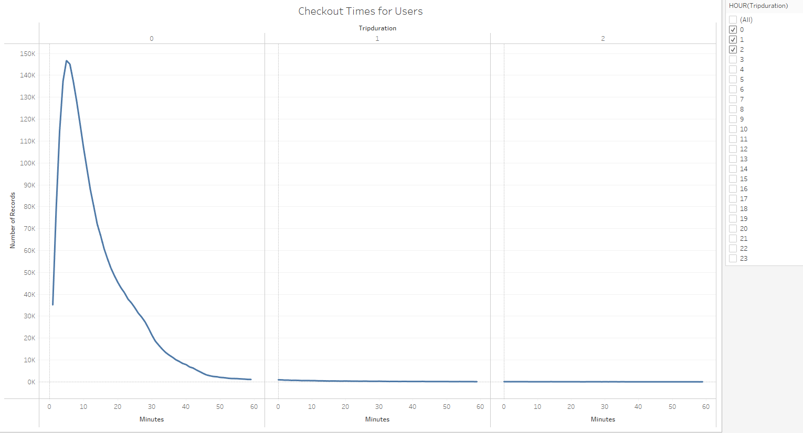
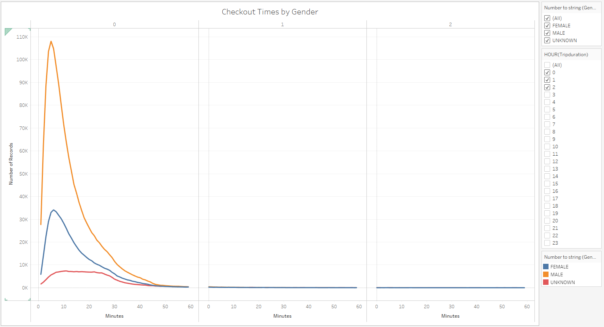
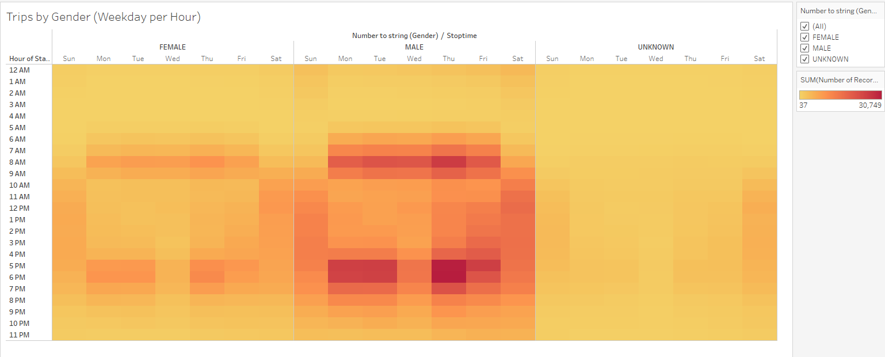
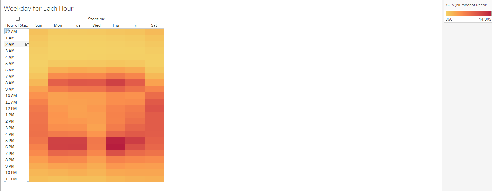

# Bikesharing Analysis
## Overview of the statistical analysis:
The purpose of this assignment is to convince investors that a bike-sharing program in Des Moines is a solid business proposal. To solidify the proposal, one of the key stakeholders would like to see a bike trip analysis.
## Results:
Below you will find a graph on the user based on checkout times for users

Here is a graph showing the checkout times by gender

This graph represents hours by gender

We also show the data by weekday hour in the graph below and gender

This one is by gender, hours and user type

## Summary:
In summary males are far more likely to checkout and use a bikesharing program than a female. Males are also more likely to use a bikesharing program between the hours of 8am and 6pm on day of the week Monday through Friday. 

## Link to Dashboard:
Please see the link to the Dashboard for the all of the tables pictured above.
[link to dashboard](https://public.tableau.com/app/profile/aaron.horneman/viz/BikeRide_Challenge_16747754228590/Story1?publish=yes)
